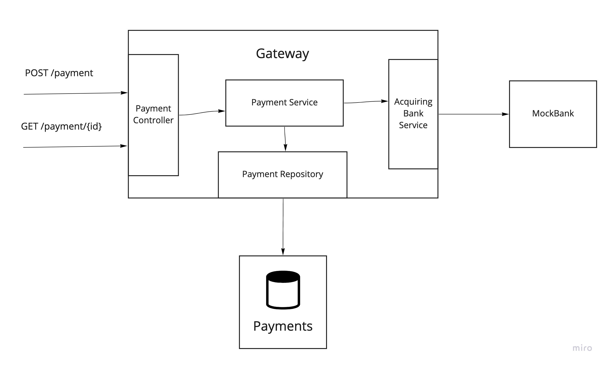

# Checkout.com .NET Challenge
## Building a Payment Gateway

ASP .NET Core 5, Fluent Validation, Entity Framework, SQLite, Xunit, Shouldly, Moq.

# Usage
Test:

```
dotnet test
```

1. Run the MockBank 
 
```
cd MockBank
dotnet run
```

2. Run the Gateway

```
cd Gateway
dotnet run
```
At startup, the Gateway creates a Payments.db sqlite database with a single Payments table in the /Gateway directory.


# API Documentation

Once the Gateway is running locally: [Swagger documentation](https://localhost:5001/swagger/index.html) 

[Postman collection](./Checkout.postman_collection.json)

# Design



1. POST /payment flow
- The payment request payload is validated using the `PaymentRequestDtoValidator`. We receive a 400 code if the card number has an invalid number of digits.
- The `PaymentController` handles the `PaymentRequestDto`, which is converted to an internal `PaymentRequest` and handed to the `PaymentService`.
- The payment services first persists the request by passing it to the payment repository which stores it in the `Payments` database.
- The `AcquiringBankService` then attempts the payment by making an HTTP call to the bank. 
- The response from the bank is persisted to the `PaymentsRepository`.
- A payment object is returned to the `PaymentController`, which returns an id of the payment as well as it's status. 

2. GET /payment/{paymentId} flow
- The `PaymentController` passes the requested `paymentId` to the `PaymentService`, which retrieves the `Payment` from the `PaymentRepository`.
- If the payment is not found in the repository, a `null` value is returned all the way to the controller, which returns a 404. 
- If the `PaymentService` receives a payment object with a `null` payment status (indicating that payment is in progress), a `null` value is also returned to the controller. 
- The controller returns the payment status as well as masked card details. 


# Limitations

- We are reading and writing from the same data model. As the complexity and scale of the application increases, we might want to separate the single table into different models for reading and writing. This can help simplify the conceptual domain model. In addition, if we see a big disparity between read and write load, this will allow us to scale and optimise each model for the specific workload. 

- We do not authenticate the merchants or persist the identity of the merchants associated with payments. We could do this using an authentication server implementing OAuth. Merchants would have to  request token that is then presented to the Gateway as an authentication mechanism. Merchants would only be allowed to retrieve details of their own payment.

- We route all payment requests to the same acquiring bank. We need to determine the bank from the card details and route the requests to the right acquiring bank.

- Sqlite as a data store does not scale to multiple instances. Hence it is not scalable or highly available. We might want to swap it out for another database (such as SQL Server or Postgres) in production.
